<div align="center">

# Karma — The Reincarnation Agent for Deprecated Services

### *"The new service passes every test. CI is green. And downstream throughput just dropped 8% because nobody knew the old service was warming a cache."*

[](https://opensource.org/licenses/MIT)
[](https://rapid-agent.devpost.com)
[](https://rapid-agent.devpost.com)
[](https://github.com/google/adk-python)
[](https://deepmind.google/technologies/gemini/)
[](https://cloud.google.com/run)

**Karma is an autonomous multi-agent system that haunts deprecated services.** It learns the undocumented behavioral contracts of an old service — latency bands, error semantics, cache writes, async side effects — and watches its replacement, filing *ghost reports* for every silent regression that passes every test but quietly breaks what lives downstream.

[**Live Dashboard**](https://karma-web-ucvx5uwt5q-uc.a.run.app) · [**API Docs**](https://karma-api-ucvx5uwt5q-uc.a.run.app/docs) · [**Demo Runbook**](docs/DEMO_RUNBOOK.md)

</div>

---

## The Problem Karma Solves

Every migration team has lived this story:

1. You retire the old payments service
2. The replacement passes every unit test, integration test, and smoke test
3. CI is green. Load tests pass. The cutover goes smoothly
4. Three weeks later, `svc-reporting` starts degrading — p95 latency climbs +540ms, throughput falls −7.8%
5. No alert fired. No test failed. No one can trace it

The culprit? The old payments service wrote a Redis summary key every 30 seconds. `svc-reporting` read that key directly. Nobody documented it. Nobody told the v3 team. **No test checked it.**

Tests check the contract you wrote down. **Karma checks the contract you forgot you had.**

---

## Live Deployment

| Service | URL |
|---------|-----|
| **Web Dashboard** | https://karma-web-ucvx5uwt5q-uc.a.run.app |
| **REST API** | https://karma-api-ucvx5uwt5q-uc.a.run.app |
| **API Swagger Docs** | https://karma-api-ucvx5uwt5q-uc.a.run.app/docs |
| **Dynatrace Tenant** | https://slm61962.apps.dynatrace.com |
| **Demo: svc-payments-v2** | https://karma-svc-payments-v2-957527396263.us-central1.run.app |
| **Demo: svc-payments-v3** | https://karma-svc-payments-v3-957527396263.us-central1.run.app |
| **Demo: svc-reporting** | https://karma-svc-reporting-957527396263.us-central1.run.app |

---

## Screenshots

### User Dashboard

| Live Overview | Services & Contracts | Ghost Reports |
|:---:|:---:|:---:|
| 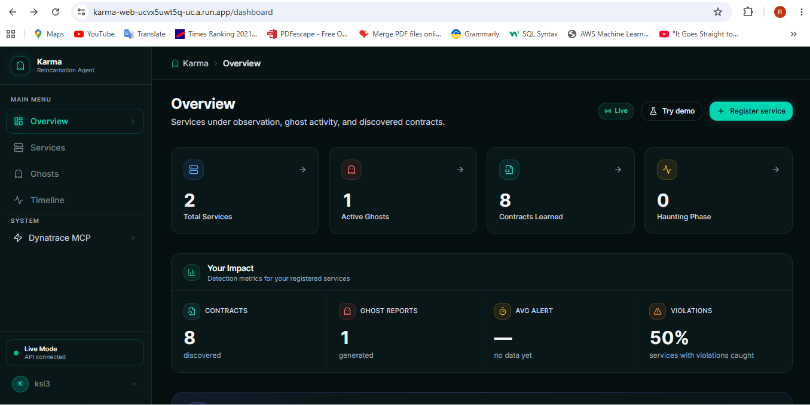 | 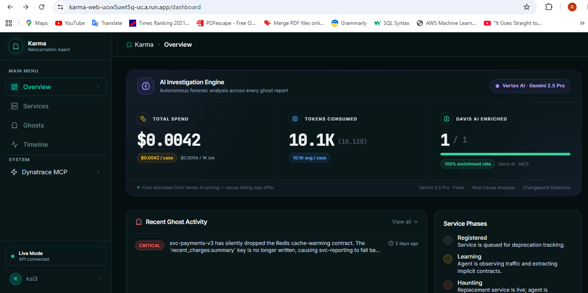 | 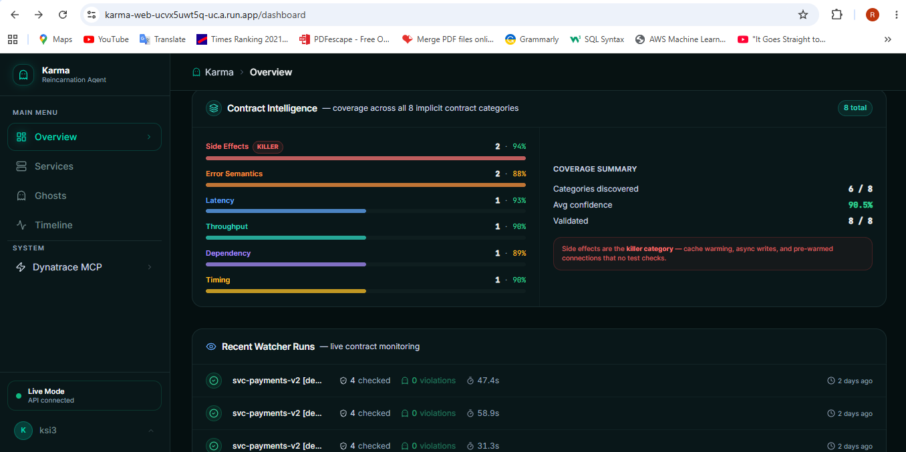 |

| Ghost Details | Event Timeline | Contract Inspector |
|:---:|:---:|:---:|
| 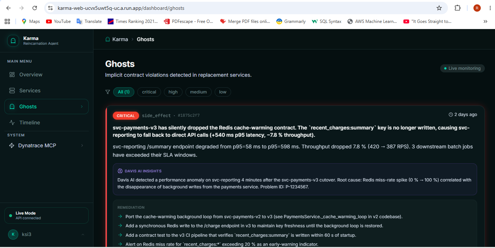 | 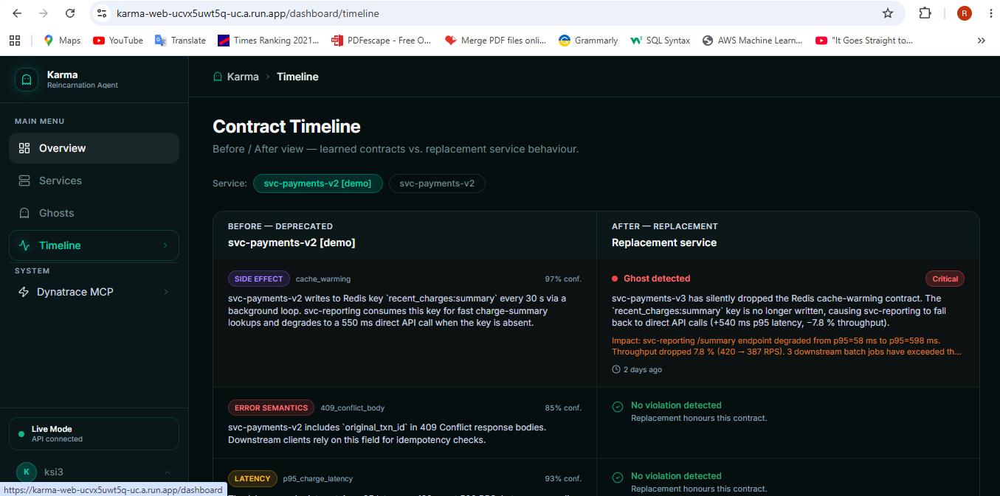 | 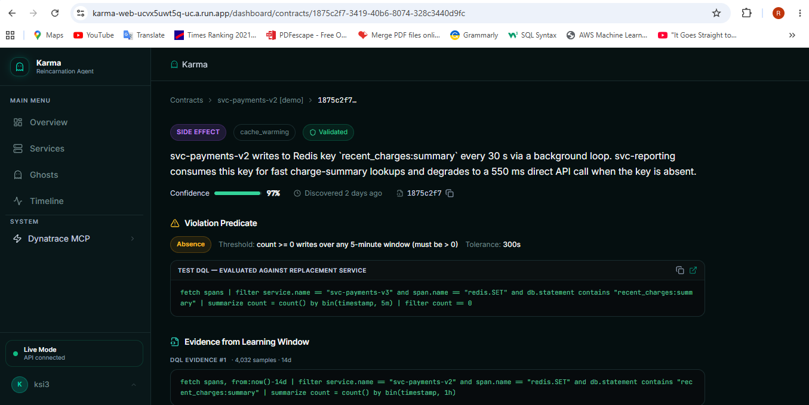 |

### Admin Dashboard

| Platform Overview | Infrastructure | Ghost Management |
|:---:|:---:|:---:|
| 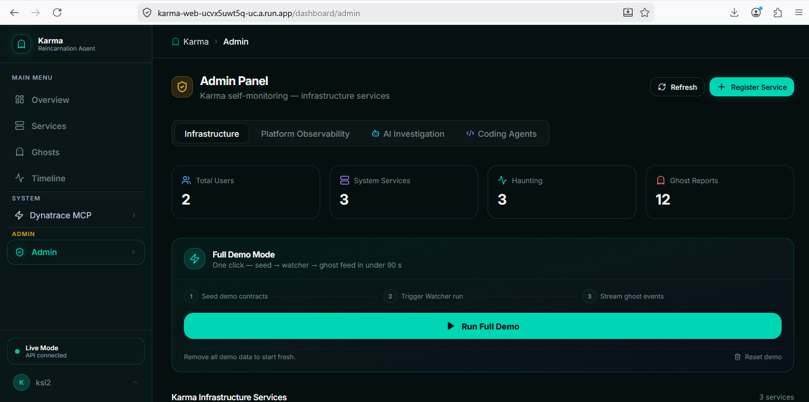 | 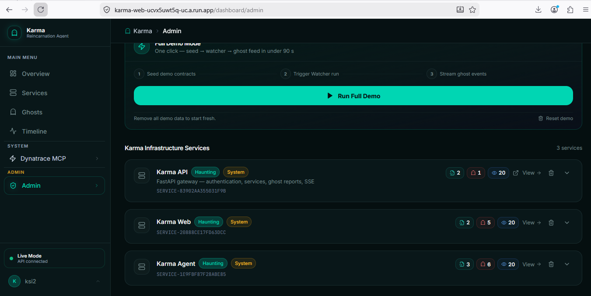 | 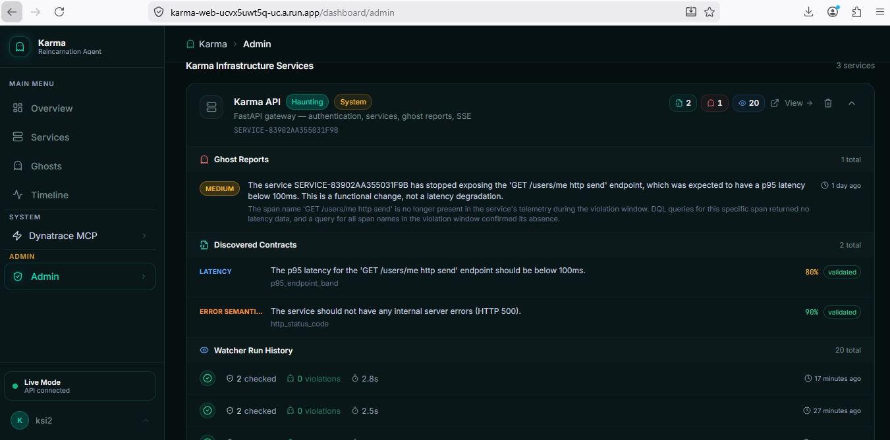 |

| AI Cost Tracking | Platform Observability | Davis AI Forensics |
|:---:|:---:|:---:|
| 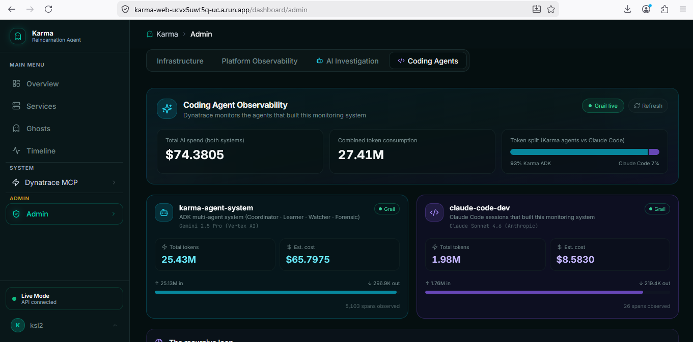 | 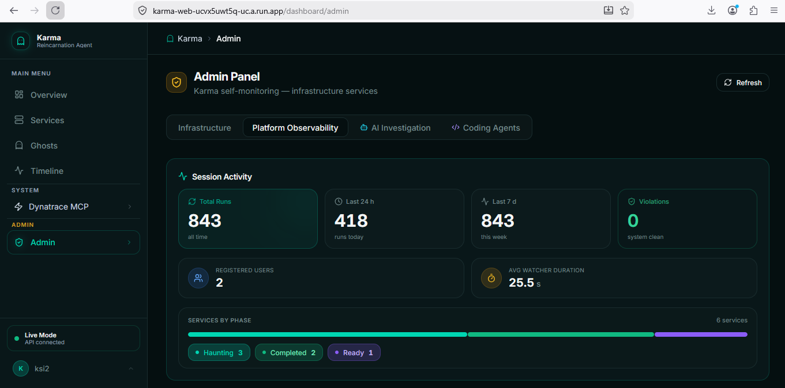 | 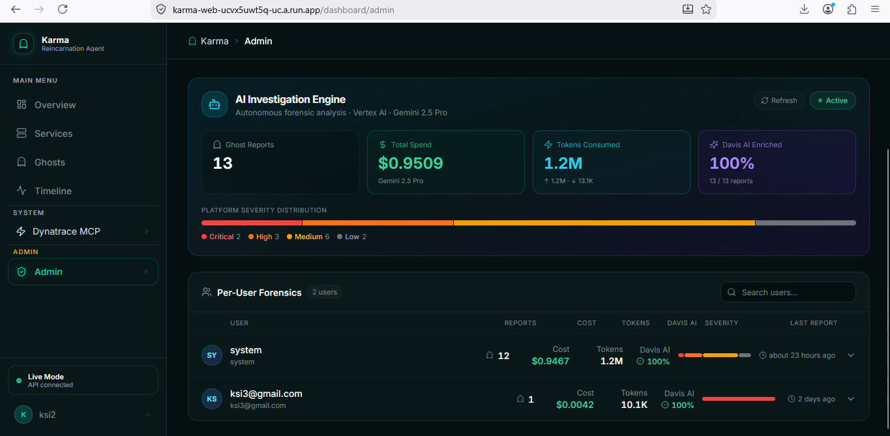 |

---

## The Marquee Demo Finding

This is the ghost report Karma files after detecting a real regression from a real deployment:

```
Ghost detected — svc-payments-v3 [CRITICAL]

Contract #4 violated: side_effect / cache_warming
  Redis writes absent for 11 consecutive minutes.
  Expected: redis.SET recent_charges:summary every 30s (32 ± 4 writes/min)
  Observed: 0 writes

Downstream impact: svc-reporting
  p95 latency:  +540ms  (was 120ms, now 660ms)
  Throughput:   -7.8%   (was 1,280 req/min, now 1,179 req/min)
  Root cause:   svc-reporting reads the Redis key directly — cold cache forces
                synchronous DB fallback on every request

Contract #2 violated: error_semantics / idempotency_response
  409 response body missing field `original_txn_id`
  Downstream clients receive null silently — no exception raised, silent data corruption

Davis AI confirms: ACTIVE PROBLEM P-2847 correlated.
Investigation notebook created: https://slm61962.apps.dynatrace.com/ui/notebooks/...
Slack notification sent to #migrations channel.
Avoided incident cost: $4,200
```

Every claim above is backed by **real Dynatrace telemetry** from the synthetic demo environment. No fabricated data.

---

## How It Works

Karma operates in two phases, powered by four specialized AI agents:

### Phase 1 — Learning (service's final weeks)

```
Deprecated service ──OTel traces──▶ Dynatrace Grail ──DQL──▶ Karma Learner
                                                              ──MCP──▶ Davis AI Analyzers
                                                                         │
                                                              Implicit Contracts
                                                              (Firestore + Memory Bank)
                                                              Dynatrace SLOs auto-created
```

The **Learner** runs Grail DQL queries across a configurable window (default 14 days), surfaces behavioral patterns across all 8 contract categories, validates each predicate against historical data to reject false positives, and registers qualifying contracts as official Dynatrace SLOs.

### Phase 2 — Haunting (after cutover)

```
Replacement service ──OTel traces──▶ Dynatrace Grail ──▶ Karma Watcher (every 10 min)
                                                              │
                                                    Violation detected?
                                                    ──Pub/Sub──▶ Karma Forensic
                                                                    │
                                                        Deep trace + log analysis
                                                        Davis AI root-cause correlation
                                                        Changepoint detection
                                                        Notebook + Workflow created
                                                        Slack / email notification
                                                              │
                                                        Ghost Report → Firestore
                                                        ──SSE──▶ Dashboard (live)
                                                        ──Annotation──▶ DT Timeline
```

---

## Four-Agent Architecture (Vertex AI Agent Builder)

Karma is built on **Google Cloud's Vertex AI Agent Builder**: the four agents are authored with the **Agent Development Kit (ADK v1.0)** and run on **Vertex AI Agent Engine**, Agent Builder's fully managed agent runtime. Every model call is **Gemini 2.5** (Pro / Flash) on Vertex AI — no non-Google models are used anywhere in the system.

| Agent | Role | Model | Runs When |
|-------|------|-------|-----------|
| **Coordinator** | Entry point — routes tasks to sub-agents via `transfer_to_agent` | Gemini 2.5 Flash | Every invocation |
| **Learner** | Discovers 8 categories of implicit contracts from 14-day telemetry window; creates Dynatrace SLOs | Gemini 2.5 Pro | Phase 1 (manual or scheduled) |
| **Watcher** | Evaluates each contract's violation predicate against recent telemetry; publishes violations to Pub/Sub | Gemini 2.5 Flash | Every 10 min (Cloud Scheduler) |
| **Forensic** | Deep evidence assembly, Davis AI root-cause, notebook/workflow creation, Slack/email alerts | Gemini 2.5 Pro | On each Pub/Sub violation message |

### Learner Tools

| Tool | What it accesses |
|------|-----------------|
| `execute_dql` | Raw Grail queries — spans, logs, metrics, events |
| `get_entity_id_via_mcp` | Resolve service name → Dynatrace entity ID (Smartscape Agent) |
| `detect_changepoints_via_mcp` | Detect behavioral shifts in any metric (Changepoint Agent) |
| `adaptive_anomaly_detection_via_mcp` | Learned thresholds with automatic baselining (Autoadaptive Threshold Agent) |
| `validate_contract_predicate` | Runs test DQL against OLD service history — rejects false positives |
| `create_slo_from_contract` | Auto-registers latency / throughput / error-rate contracts as Dynatrace SLOs |
| `emit_karma_event` | BizEvents self-observability: `karma.contract.discovered`, `karma.learning.complete` |
| `save_contracts_to_firestore` | Persists to dashboard |
| `save_contracts_to_memory_bank` | Cross-session contract storage in Vertex AI Memory Bank |

### Watcher Tools

| Tool | What it accesses |
|------|-----------------|
| `load_contracts_from_memory_bank` | Retrieve contracts when Agent Engine restarts |
| `execute_dql` | Evaluate violation predicates against recent telemetry |
| `query_problems_via_mcp` | AI-enriched root cause from Davis Root Cause Agent |
| `list_problems_via_mcp` | Cross-correlate violations with active Davis AI problems (bidirectional integration) |
| `get_entity_name_via_mcp` | Resolve entity IDs to human-readable names |
| `publish_violation_to_pubsub` | Async violation handoff to Forensic agent |

### Forensic Tools

| Tool | What it accesses |
|------|-----------------|
| `execute_dql` | Deep trace + log pull (15-min window, cross-service) |
| `query_problems_via_mcp` | AI-enriched Davis root-cause analysis |
| `get_problem_details_via_mcp` | Full details of correlated Davis problems |
| `detect_changepoints_via_mcp` | Pinpoint exact moment of behavioral shift |
| `ask_dynatrace_docs_via_mcp` | Davis AI remediation guidance from knowledge base |
| `find_troubleshooting_guides_via_mcp` | Dynatrace troubleshooting knowledge base |
| `send_event_via_mcp` | CUSTOM_ANNOTATION on service timeline (bidirectional DT integration) |
| `create_dynatrace_notebook_via_mcp` | Collaborative investigation notebook (HIGH + CRITICAL) |
| `create_workflow_for_notification_via_mcp` | Recurring-problem workflow (CRITICAL only) |
| `send_slack_message_via_mcp` | Slack notification to `#migrations` (HIGH + CRITICAL) |
| `send_email_via_mcp` | Email alert (CRITICAL only) |
| `get_session_cost_estimate` | Token count + USD cost of this investigation |
| `emit_karma_event` | BizEvent: `karma.ghost_report.created` (queryable via `fetch bizevents`) |
| `save_ghost_report_to_firestore` | Persist structured ghost report |
| `push_ghost_report_to_dynatrace` | Timeline annotation — CUSTOM_ANNOTATION event |

---

## The Eight Implicit Contract Categories

These are the behavioral dimensions that **no test or SLO definition typically captures**:

| # | Category | What Karma Learns | Why It Matters |
|---|----------|--------------------|----------------|
| 1 | **Latency** | p50/p95/p99 per endpoint, per hour-of-day | Regression invisible unless you know the historical baseline |
| 2 | **Error Semantics** | Status codes and payload shapes under specific conditions | Field `original_txn_id` missing in 409 = silent null pointer downstream |
| 3 | **Throughput** | QPS bands and burst-capacity envelope | Sudden drop in traffic = cache starvation, not just load |
| 4 | **Side Effects** *(the killer)* | Cache writes, log records, async tasks, pre-warmed connections | The Redis write that `svc-reporting` depends on — documented nowhere |
| 5 | **Timing** | Order of operations; gap between call and downstream effect | 30s cache TTL means svc-reporting degrades before the first alert fires |
| 6 | **Dependency** | Which downstream services are called, at what frequency | Hidden fan-out that v3 removed |
| 7 | **Resource** | Connection-pool usage, memory steady-state, file descriptors | Steady memory growth that never exceeds a threshold — but trends wrong |
| 8 | **Sequencing** | Retry behavior, idempotency assumptions, ordering guarantees | Idempotency key contract that v3 implements differently |

---

## Key Features

### Autonomous Contract Discovery
The Learner analyzes up to 14 days of Dynatrace Grail telemetry (spans, logs, metrics, events) across all 8 categories. Each candidate contract is validated against the service's own historical data — false positives are rejected before they ever watch the replacement.

### Dynatrace SLO Auto-Creation
For latency, throughput, and error-semantics contracts, the Learner automatically registers the discovered contract as an official Dynatrace SLO with burn-rate alerting enabled. Karma doesn't just discover contracts — it enforces them.

### Agentic Remediation — Patch to Draft PR
For every ghost report the Forensic agent (Gemini 2.5 Pro) generates a concrete unified-diff patch that restores the violated behavior, plus a full PR description (What / Why / How it was found / Verification). One click on the dashboard pushes that patch to GitHub as a **draft pull request** on its own branch — closing the loop from detection → root cause → reviewable fix. PR creation is opt-in via a separate write-scoped token, always opens a *draft* for human review, and never merges.

### Bidirectional Dynatrace Integration
Karma both reads from and writes back to Dynatrace:
- **Reads:** Grail DQL (spans, logs, metrics), Davis AI analyzers via MCP, Smartscape entity resolution, changepoint detection
- **Writes:** CUSTOM_ANNOTATION events on service timelines, BizEvents for self-observability (`fetch bizevents | filter event.type startsWith "karma."`), SLOs, Notebooks, Workflows

### Async Pub/Sub Violation Pipeline
```
Cloud Scheduler (every 10 min)
  → Watcher agent
    → violation confirmed
      → Pub/Sub topic karma-violations
        → Forensic agent (async)
          → ghost report → Firestore
            → SSE push → dashboard (live, sub-second)
```

### Migration Readiness Score
Every service under haunting gets a weighted compliance score (0–100) across all 8 contract categories. The score accounts for violation severity, contract confidence, and the "killer category" weight multiplier for side effects.

### Auto-Completion
After `N` consecutive clean Watcher runs (default: 3), a service transitions automatically from `haunting` → `completed`. No manual intervention required.

### Real-Time Dashboard
The Next.js dashboard receives ghost reports, watcher run updates, and AI cost events via Server-Sent Events — sub-second latency from agent output to browser animation.

### Full Self-Observability
Every agent run emits OTel spans to Dynatrace. BizEvents capture every discovered contract, every violation, and every ghost report. The admin panel's **Coding Agents** tab shows a side-by-side cost comparison: Karma's Gemini 2.5 production agents vs the developer's Claude Code coding sessions — both queryable via live DQL.

> **To be unambiguous:** Karma's application runs entirely on **Gemini 2.5 via Vertex AI** — no Anthropic or other non-Google model is used in the product. Claude Code appears *only* in the Coding Agents tab as an example of Dynatrace's [AI Coding Agent Monitoring](https://www.dynatrace.com/news/blog/dynatrace-expands-ai-coding-agent-monitoring/) — i.e. Karma observing the *developer's tooling* through Dynatrace, exactly as Dynatrace intends. It never participates in Karma's agent reasoning.

---

## Architecture

```
┌──────────────────────────────────────────────────────────────────────┐
│  Next.js Dashboard (Cloud Run)                                        │
│  · Landing page + 6-page dashboard                                   │
│  · Firebase Auth (Google sign-in) · OTel instrumented                │
└─────────────────────────────┬────────────────────────────────────────┘
                              │ HTTPS REST + Server-Sent Events
                              ▼
┌──────────────────────────────────────────────────────────────────────┐
│  FastAPI Gateway (Cloud Run)                                          │
│  30+ routes: /services  /contracts  /ghosts  /cutover  /stream       │
│               /admin  /stats  /users  /demo  /pubsub  /readiness     │
└────────┬───────────────────────────────────────┬─────────────────────┘
         │                                       │
         ▼                                       ▼
┌─────────────────┐            ┌───────────────────────────────────────┐
│  Firestore       │            │  Agent Engine  (long-running AdkApp)  │
│  · services      │            │  ┌────────────┐                       │
│  · contracts     │            │  │ Coordinator│ ← entry point         │
│  · violations    │            │  └──┬──┬──┬───┘                       │
│  · ghost_reports │            │     ▼  ▼  ▼                           │
│  · users         │            │  Learner Watcher Forensic             │
│  · watcher_runs  │            │                                       │
└─────────────────┘            │  Vertex AI Memory Bank                │
                               │  (contracts survive agent restarts)   │
                               └───────────────────┬───────────────────┘
                                                   │ MCP (HTTPS + Bearer)
                                                   ▼
                               ┌───────────────────────────────────────┐
                               │  Dynatrace MCP Server (hosted)         │
                               │  Davis AI · Grail · Smartscape · SLOs  │
                               └───────────────────┬───────────────────┘
                                                   │
                                                   ▼
                               ┌───────────────────────────────────────┐
                               │  Dynatrace Tenant                      │
                               │  Grail data lake · Davis AI analyzers  │
                               │  Notebooks · Workflows · SLOs          │
                               └───────────────────┬───────────────────┘
                                                   │ OTLP/HTTP
                                                   ▼
                               ┌───────────────────────────────────────┐
                               │  Synthetic Demo Environment            │
                               │  · svc-payments-v2 (hidden Redis write)│
                               │  · svc-payments-v3 (no Redis write)    │
                               │  · svc-reporting (Redis reader)        │
                               │  · k6 load generator (Cloud Scheduler) │
                               └───────────────────────────────────────┘
```

For the full system diagram see [docs/ARCHITECTURE.md](docs/ARCHITECTURE.md).

---

## Service Lifecycle

```
registered ──Learner──▶ learning ──contracts saved──▶ ready ──cutover──▶ haunting ──N clean runs──▶ completed
                                                                  │
                                                               error (Learner failed)
```

| State | Meaning |
|-------|---------|
| **registered** | Created in Firestore, awaiting Learner |
| **learning** | Learner agent running; DQL analysis in progress |
| **ready** | Contracts discovered and validated; awaiting cutover |
| **haunting** | Watcher active every 10 min; Forensic triggered on violations |
| **completed** | Migration validated — user-triggered or auto after N clean Watcher runs |

---

## Dashboard Pages

| Page | Path | What It Shows |
|------|------|--------------|
| **Overview** | `/dashboard` | Stats strip, ghost activity feed, watcher run history, contract intelligence breakdown, AI investigation engine cost panel, live watcher log (SSE) |
| **Services** | `/dashboard/services` | Register new services, view phase status, trigger Learner/Watcher manually, migration readiness score |
| **Service Detail** | `/dashboard/services/[id]` | Contract list, migration readiness gauge, per-category compliance bars, avoided cost total |
| **Ghosts** | `/dashboard/ghosts` | All ghost reports with severity, Davis AI insights, DT deep links (problem, entity, notebook, BizEvent, timeline annotation) |
| **Timeline** | `/dashboard/timeline` | Chronological contract discovery view; before/after service comparison |
| **Contract Detail** | `/dashboard/contracts/[id]` | Full contract spec, violation predicate DQL, evidence, sparkline trend |
| **Admin** | `/dashboard/admin` | Infrastructure management, platform observability, AI investigation engine, coding agents token/cost comparison |

---

## Tech Stack

| Layer | Technology |
|-------|------------|
| **Agent platform** | Vertex AI Agent Builder (Google Cloud) |
| **Agent framework** | Agent Development Kit (ADK v1.0, Python) — part of Vertex AI Agent Builder |
| **Agent runtime** | Vertex AI Agent Engine — Agent Builder's managed runtime (long-running `AdkApp`) |
| **AI models** | Gemini 2.5 Pro (Learner, Forensic) · Gemini 2.5 Flash (Coordinator, Watcher) |
| **Agent memory** | Vertex AI Memory Bank (`VertexAiMemoryBankService`) |
| **Partner integration** | Dynatrace MCP Server (hosted, Bearer token) |
| **Observability** | OpenTelemetry → Dynatrace Grail (spans, BizEvents, SLOs) |
| **API gateway** | FastAPI + structlog on Cloud Run |
| **Database** | Firestore (services, contracts, violations, ghost reports, users) |
| **Message bus** | Cloud Pub/Sub (async Watcher → Forensic handoff) |
| **Scheduling** | Cloud Scheduler → Pub/Sub → Watcher (every 10 min) |
| **Frontend** | Next.js 15 + TypeScript + Tailwind CSS + ShadCN/UI on Cloud Run |
| **Authentication** | Firebase Auth (Google sign-in only) |
| **Secrets** | Google Secret Manager (no secrets in env or code) |
| **CI/CD** | GitHub Actions + Workload Identity Federation → Cloud Run / Agent Engine |
| **Infrastructure** | Terraform (Cloud Run, Firestore, Pub/Sub, Secret Manager, IAM) |

---

## Quick Start

### Prerequisites

- Python 3.11+
- Node.js 20+
- Google Cloud project with Vertex AI, Cloud Run, Firestore, and Pub/Sub enabled
- Dynatrace SaaS tenant with a Platform Token and a Classic API token (see [docs/DYNATRACE_SETUP.md](docs/DYNATRACE_SETUP.md))

### 1. Clone and configure

```bash
git clone https://github.com/rogerjeasy/karma.git
cd karma
cp .env.example .env
# Edit .env — fill in GCP project, Dynatrace env/tokens, Firebase config
```

### 2. Agents (local dev)

```bash
cd agents
pip install -e ".[dev]"
adk run karma.app
```

### 3. API gateway

```bash
cd api
pip install -e ".[dev]"
uvicorn app.main:app --reload --port 8001
```

### 4. Web dashboard

```bash
cd web
cp .env.local.example .env.local
# Fill in NEXT_PUBLIC_FIREBASE_*, NEXT_PUBLIC_API_URL, NEXT_PUBLIC_DT_ENV
npm install
npm run dev
```

### 5. Synthetic demo environment

```bash
cd synthetic-env
docker compose up
# svc-payments-v2 on :8010  (hidden Redis write every 30s)
# svc-payments-v3 on :8011  (no Redis write — the regression)
# svc-reporting   on :8012  (Redis reader — degrades on cache miss)
# Redis           on :6379
```

See [docs/DEMO_RUNBOOK.md](docs/DEMO_RUNBOOK.md) for the complete end-to-end reproduction guide including the fastest path (Admin Panel demo seed — under 2 minutes).

---

## Deployment

All production deployments run via GitHub Actions with Workload Identity Federation (no long-lived service account keys):

```bash
# Push to main triggers all four workflows in parallel:
.github/workflows/deploy-agents.yml        → Vertex AI Agent Engine
.github/workflows/deploy-api.yml           → Cloud Run (api)
.github/workflows/deploy-web.yml           → Cloud Run (web)
.github/workflows/deploy-synthetic-env.yml → Cloud Run (demo services × 3)
```

Infrastructure is managed with Terraform under `infrastructure/terraform/`. See [docs/GITHUB_ACTIONS_SETUP.md](docs/GITHUB_ACTIONS_SETUP.md) for the Workload Identity Federation setup.

---

## API Reference

The full interactive spec is at `/docs` (Swagger) and `/redoc`. Key endpoints:

| Route | Method | Purpose |
|-------|--------|---------|
| `POST /services` | Auth | Register a service and trigger the Learner |
| `POST /cutover` | Auth | Transition a service to haunting phase |
| `GET /services/{id}/migration-readiness` | Auth | Weighted compliance score (0–100) |
| `GET /ghosts` | Auth | Full ghost report feed |
| `GET /contracts/{id}` | Auth | Contract detail with DQL evidence |
| `GET /stream` | Auth | SSE event stream (ghost reports, watcher runs, cost updates) |
| `POST /demo/seed` | Auth | Seed the demo scenario (idempotent) |
| `GET /admin/agent-observability` | Admin | ADK + Claude Code token spend from Grail |
| `POST /pubsub/watcher-tick` | Internal | Cloud Scheduler → Watcher trigger |
| `POST /pubsub/violation` | Internal | Pub/Sub → Forensic trigger |

---

## Project Structure

```
karma/
├── agents/                  # Google ADK agent system
│   └── karma/
│       ├── coordinator.py   # Entry point — routes to sub-agents
│       ├── learner.py       # Phase 1: contract discovery
│       ├── watcher.py       # Phase 2: violation detection (Gemini 2.5 Flash)
│       ├── forensic.py      # Phase 2: deep investigation + ghost reports
│       ├── schemas/
│       │   └── contract.py  # Pydantic contract schema (source of truth)
│       ├── tools/
│       │   ├── dynatrace_api_tools.py   # Raw DQL execution
│       │   ├── dynatrace_events.py      # BizEvents ingest
│       │   ├── dynatrace_slo.py         # Auto-create Dynatrace SLOs
│       │   ├── dynatrace_problems.py    # Ghost report annotations
│       │   ├── mcp_gateway_tools.py     # All Dynatrace MCP server tools
│       │   ├── memory_bank_tools.py     # Vertex AI Memory Bank read/write
│       │   ├── firestore_tools.py       # Contract + ghost report persistence
│       │   ├── pubsub_tools.py          # Violation pub/sub publish
│       │   └── contract_validator.py    # False-positive rejection
│       └── prompts/
│           ├── learner_system.md        # Learner agent instructions
│           └── forensic_system.md       # Forensic agent instructions
├── api/                     # FastAPI gateway (Cloud Run)
│   └── app/
│       ├── main.py          # App factory + lifespan + CORS
│       ├── routes/          # 11 route modules (services, contracts, ghosts, …)
│       ├── agent_client.py  # Agent Engine invocation
│       ├── dt_client.py     # Dynatrace API client
│       └── webhooks.py      # SSE + Firestore listener
├── web/                     # Next.js dashboard (Cloud Run)
│   ├── app/dashboard/       # 6 dashboard pages
│   ├── components/
│   │   ├── GhostCard.tsx              # Ghost report card + DT deep links
│   │   ├── MigrationReadinessScore.tsx # Gauge + per-category compliance bars
│   │   ├── WatcherLiveLog.tsx          # SSE terminal-style watcher stream
│   │   ├── ContractRadarChart.tsx      # Category compliance radar
│   │   ├── DemoRunPanel.tsx            # Admin demo seed/reset panel
│   │   └── ViolationPulse.tsx          # Live ghost pulse animation
│   └── lib/
│       ├── sse-context.tsx  # SSE event bus
│       └── types.ts         # Shared TypeScript types
├── synthetic-env/           # Three-service demo environment
│   ├── svc-payments-v2/     # Deprecated service (hidden Redis write)
│   ├── svc-payments-v3/     # Replacement (no Redis write — the regression)
│   ├── svc-reporting/       # Downstream consumer (Redis-dependent)
│   └── load-generator/      # k6 + Python traffic simulation
├── infrastructure/
│   └── terraform/           # Cloud Run, Firestore, Pub/Sub, IAM, Secret Manager
├── docs/
│   ├── ARCHITECTURE.md      # Full system diagram
│   ├── CONTRACT_SCHEMA.md   # JSON Schema reference
│   ├── DEMO_RUNBOOK.md      # Judge reproduction guide
│   └── DYNATRACE_SETUP.md   # Token scopes and tenant configuration
└── scripts/                 # Seed, reset, golden-run snapshot utilities
```

---

## Environment Variables

| Variable | Service | Purpose |
|----------|---------|---------|
| `GCP_PROJECT_ID` | agents, api | Google Cloud project |
| `DT_ENV` | agents, api | Dynatrace environment name (derives tenant URLs) |
| `DT_API_TOKEN` | agents | Platform Token — MCP gateway (Bearer auth) |
| `DT_OTEL_TOKEN` | agents, api | Classic API token — OTel + BizEvents + SLOs + Events ingest |
| `DT_QUERY_TOKEN` | api | Classic API token — Grail read (agent observability) |
| `MEMORY_BANK_ID` | agents | Vertex AI Memory Bank resource ID |
| `AGENT_ENGINE_RESOURCE_NAME` | api | Full Agent Engine resource name |
| `FIRESTORE_DATABASE` | agents, api | Firestore database name |
| `GITHUB_TOKEN` | api | Fine-grained PAT (contents:read + pull-requests:read) — deployment metrics |
| `GITHUB_WRITE_TOKEN` | api | Fine-grained PAT (contents:write + pull-requests:write) — opens remediation draft PRs; blank = disabled |

Required DT_OTEL_TOKEN scopes: `openTelemetryTrace.ingest`, `logs.ingest`, `metrics.ingest`, `events.ingest`, `bizevents.ingest`, `slo.write`

---

## Security

- All secrets via **Google Secret Manager** — nothing in environment variables or source code
- Firebase Auth enforces authentication on every dashboard route; the API validates Firebase ID tokens on every request
- Admin routes require `admin` role in `users/{uid}.roles` — checked server-side, never client-side
- Dynatrace tokens are kept strictly scoped: Platform Token for MCP only, separate Classic tokens for OTel ingest and Grail read
- No user data stored in Memory Bank — only service telemetry patterns
- GitHub read integration (deployment metrics) uses a fine-grained PAT with `contents:read` + `pull-requests:read` only; opening remediation PRs uses a separate, optional write-scoped PAT (`GITHUB_WRITE_TOKEN`) — least privilege, and PR creation is disabled when it is unset
- Cloud Run services that don't need public access are deployed as internal-only

---

## Hackathon Disclosure

Built for the [Google Cloud Rapid Agent Hackathon — Dynatrace Track](https://rapid-agent.devpost.com), submission deadline June 11, 2026.

**Required-stack compliance:**
- **Powered by Gemini** — every model call in the application is Gemini 2.5 Pro or Gemini 2.5 Flash on Vertex AI.
- **Built with Google Cloud Agent Builder** — the agents use the Agent Development Kit (ADK v1.0) and run on Vertex AI Agent Engine, the managed runtime within Vertex AI Agent Builder.
- **Integrates the partner's MCP server** — the Dynatrace MCP Server (hosted gateway) is called for Davis AI root-cause, Smartscape entity resolution, changepoint/anomaly detection, Notebooks, Workflows, SLOs, and notifications.
- **Platform** — runs on the web.

The `synthetic-env/` directory is a purpose-built three-service demo environment. It is not production traffic. Every claim in a ghost report is backed by real Dynatrace telemetry from that environment — the Redis write truly happens, the cache truly warms, the downstream service truly degrades when it stops.

**No OpenAI, Anthropic, or other non-Google AI services are used in the application — Gemini family only.** Claude Code appears solely in the admin "Coding Agents" tab, where Karma *observes* the developer's coding tool through Dynatrace's AI Coding Agent Monitoring. It is a telemetry source, never part of Karma's agent reasoning.

---

## License

[MIT](LICENSE) © 2026 Roger Jeasy Bavibidila ([@rogerjeasy](https://github.com/rogerjeasy))
